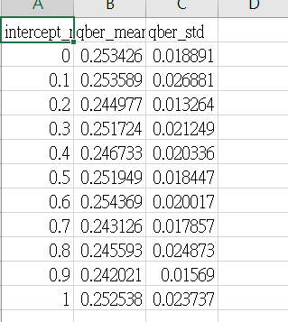

#🧪專案總覽：量子密碼學模擬與後量子安全應用
此專案為一套自學實作導向的資安模擬平台，整合經典 BB84 量子金鑰分發協定與 RSA、PQC 等主題，包含基礎模型、進階攻擊模擬、錯誤率分析與未來擴展空間，適用於高中生、大學生、研究者或任何對量子資安有興趣的開發者參考。

#📁 專案總體結構
bb84_qkd/
├── bb84_basic.py               # 基本 BB84 協定模擬（無 Eve）
├── eve_basic_attack.py         # Eve 攔截 qubit 模型 + QBER 分析
├── eve_impostor_attack.py      # Eve 假冒 Alice/Bob 的進階攻擊
├── qber_vs_intercept_ratio.py  # QBER 與攔截比例模擬與圖表
├── requirements.txt            # 依賴套件列表
├── README.md                   # 本專案說明文件（您正在閱讀）
├── 自述文件.md                  # 初期備份紀錄
└── images/
    ├── qber_vs_intercept_ratio.png
    └── qber_mean_std_table.png

🧠 核心實作摘要
🔹 模擬 Alice 與 Bob 傳輸與測量 qubit 的全流程

🔹 加入 Eve 攔截 qubit 並分析基底猜測失誤所造成的 QBER 上升

🔹 可視化 QBER 與攔截比例的關係圖表

🔹 進階模型：Eve 假冒 Alice 或 Bob，探討身份偽造風險

📊 攻擊模擬與錯誤率分析
✅ QBER vs 攔截比例 模擬（2025/07/15 新增）
在 qber_vs_intercept_ratio.py 中，模擬 Eve 以 0.0～1.0 攔截比例攻擊 BB84 系統，觀察 QBER 的變化：

攔截越多 qubit、猜錯基底機率越高 → QBER 上升

最極端情況（100% 攔截）時，QBER 約為 24%

📈 圖表展示：

📋 對應資料：

此圖表與資料表可用於進一步繪製誤差條圖，提升學術可信度與可讀性。

🧱 安全性實驗延伸方向
🧪 Partial Intercept 攻擊：只攔截部分 qubit，模擬更隱蔽的行為

🧠 記憶型 Eve（Memory-based）：只記錄資訊，延遲攻擊

🔐 加入 PQC（Post-Quantum Cryptography）模擬與對照

🔄 比較 BB84 與 E91 協定在不同攻擊下的表現

🛡️ 建立 QKD + PQC 結合架構，用於國防與高階資通安全系統

🌐 國際標準與產業趨勢（2024–2025）
機構	內容說明
🇺🇸 NIST	公布 PQC 標準：Kyber、Dilithium 為首選演算法
🇪🇺 ETSI	推動 QKD + PQC 整合通訊標準、模擬跨層防禦
🌐 ISO/IEC 23837	設計 QKD 與 PQC 混合密鑰交換流程、強化跨國通訊
💻 執行方式
請先確認已安裝 Python 3.x：

pip install -r requirements.txt

python bb84_basic.py
python eve_basic_attack.py
python eve_impostor_attack.py
python qber_vs_intercept_ratio.py

🔧 版本紀錄
2025/07/15：新增 QBER vs 攔截比例模擬與圖表

2025/07/14：實作 Eve 假冒 Alice/Bob 模型

2025/07/13：整合 BB84 與 Eve 攻擊模擬主架構

🧩 預告：即將加入
🧮 RSA 基本演算法模擬（已完成初步模組）

🔐 PQC 與 QKD 結合模型（Hybrid Cryptography in Q-era）

本專案持續更新，預計整合多種後量子密碼模擬，並以可教學、可視化、可驗證為設計原則，打造可用於研究與特殊選才的資安模擬平台。

📫 聯絡方式（如需）
如您有建議、合作意願或想進一步交流，歡迎透過 Issues 或私訊聯絡作者。
作者:Kailyn 高二生在讀

