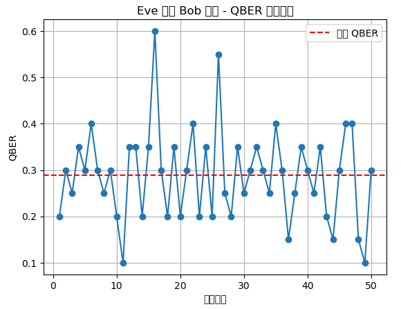

# 🧠 量子資安模擬與混合式加密架構實作

> 📌 本專案由高中階段自學者李佳穎(Kailyn)獨立完成，作為自身對量子密碼學與資安議題長期探索的階段性成果，亦同步作為特殊選才作品呈現。研究歷程橫跨 BB84、PQC、RSA 到攻擊模擬與混合架構整合，所有內容皆由零起點自學與實作完成，並透過 Python 建立可視化與模組化呈現，期望未來能延伸至國防與實務應用場景。

本專案核心目的為模擬「量子金鑰分發（QKD）」與「後量子密碼學（PQC）」兩大領域的應用場景與攻防模式，並嘗試整合成一套混合式加密架構。所有模組皆配有程式碼、圖示、自述文件與執行說明，期望達成以下幾點目標：

- ✅ 結合理論與實作，讓密碼學概念更具體  
- ✅ 提供可重現的工程架構，方便教學與未來擴充  
- ✅ 展現工程思維、自主學習與探索精神

---

**📄 著作權與使用聲明**

本專案之 **程式碼** 依 [MIT License](./LICENSE) 開源授權，任何人均可於保留授權聲明的前提下自由使用、修改與散佈。

本專案之 **白皮書（PDF）、圖表、文字內容** 著作權由作者 **李佳穎（Kailyn）** 保留，未經書面同意不得轉載、修改或發表於其他平台。引用或參考內容時，請標明作者姓名與來源連結。

GitHub 專案連結：<https://github.com/kailyn17/BB84-Simulation>

---

## 🛠️ 從 0 到 1：自學歷程與技術成長

在沒有任何資安、量子、程式背景的情況下，我從高中階段開始透過開源資源與 ChatGPT 引導進行自學，逐步從理解 BB84 協定的基本流程開始，延伸到模擬 Eve 攻擊模型、計算 QBER 錯誤率，最終嘗試結合後量子加密（PQC）與 QKD 架構，實作混合式密鑰交換流程。

整個過程中，我不僅需理解密碼學背後的邏輯，也需逐步學會 Python 寫法、模組設計、錯誤排查與版本管理。我曾花數小時只為 debug 一行攔截邏輯錯誤，也曾因為流程圖無法產出卡關許久。這些問題並非單純抄範例可解，而是每一步都透過試錯與理解，才能完成程式執行與模擬結果重現。

📝 本專案的程式與說明文件皆先於 Google Colab 與 Google 文件中逐步撰寫與測試，完成後再統一整理上傳至 GitHub。因此提交紀錄可能無法完整反映每段開發歷時，但完整的 commit 歷程與檔案變動可作為實作佐證。若需查看開發截圖與 debug 紀錄，可參閱白皮書或學習歷程補充資料。

---

## 🧩 模組導覽與功能總覽

本專案依據模擬功能分為四大模組資料夾，分別對應不同的密碼學架構與攻擊場景：

---

### 🔐 `bb84_qkd/`：量子金鑰分發與攻擊模擬模組

📘 用途場景：模擬經典 BB84 協定下的金鑰產生流程，並進行紅隊攻擊視角的實驗操作。

🎯 教學應用價值：
- 展示學生對量子協定與資安威脅模型的理解與轉化能力
- 可延伸應用於國防量子通訊風險分析與教育訓練模組
- QBER 與攔截比例的分析有助於研究預警機制的臨界參數

模組內容：
- `bb84_basic.py`：基本 BB84 金鑰交換流程模擬（含 Alice 與 Bob 機制）
- `eve_basic_attack.py`：攔截轉送型攻擊（Intercept-Resend Eve 模型）
- `eve_impostor_attack.py`：假冒型 Eve 模型，模擬 Eve 冒充 Alice 或 Bob 的資訊交換
- `qber_vs_intercept_ratio.py`：模擬不同攔截比例下的 QBER（錯誤率）變化趨勢
- `images/qber_vs_intercept_ratio.png`：對應圖表呈現攔截與錯誤率關係
- 📘 自述文件：`README_BB84_BASIC.md`、`README_EVE_BASIC.md`、`README_EVE_IMPOSTOR.md`、`README_QBER_ANALYSIS.md`  
- 📊 **補強完成**：根據教授建議，已補充 **協定流程安全性邏輯** 與 **QBER 錯誤模型圖像**

📊 **成果可視化**  

---

### 🔄 `pqc_qkd_hybrid/`：混合式密鑰交換模擬模組

📘 用途場景：模擬 QKD 所產生的密鑰如何作為 PQC 的一環，用於加密實際資訊，反映國際混合式加密發展趨勢。

🎯 教學應用價值：
- 與 NIST PQC 發展方向呼應，可作為新世代密碼設計的教學雛形
- 實作架構具備再現性與工程思維，可延伸至實務通訊模擬場景
- 對混合式密鑰交換架構有初步落地意識，展現主題整合能力

模組內容：
- `pqc_qkd_hybrid_simulation.py`：主程式，結合 QKD 金鑰導出位移量，用 PQC 加密文字
- `qkd_module.py`：QKD 金鑰產生模組（將 BB84 的金鑰流程整理成函式）
- `pqc_module.py`：簡化 PQC 模組，模擬整數位移式公開金鑰加密（使用整數位移邏輯）
- `draw_hybrid_flowchart.py`：流程圖產生腳本，輸出 `hybrid_flowchart.png`
- `images/hybrid_flowchart.png`：完整混合式流程圖，對應模擬執行順序
- 📘 自述文件：`README_HYBRID_SIM.md`、`README_PQC_MODULE.md`、`README_QKD_MODULE.md`

📊 **混合式流程圖**  

---

### 🔑 `pqc_rsa_diagram/`：RSA 加密流程視覺化模組

📘 用途場景：以圖形方式呈現 RSA 加解密邏輯流程，用來輔助說明傳統公開金鑰加密與 PQC 架構的異同。

🎯 教學應用價值：
- 顯示學生具備傳統密碼學概念基礎，可作為 PQC 學習的對照組
- 視覺化處理使得教學與引導更具直觀性
- 幫助教授判斷學生並非僅學習新潮名詞，而是真正從基礎出發逐步理解

模組內容：
- `rsa_process_diagram.py`：RSA 加解密流程圖繪製腳本
- `images/rsa_process.png`：RSA 加解密流程圖
- 📘 自述文件：`README.md`

📊 **RSA 流程圖**  

---

### 🧪 `quantum_red_team_simulation/`：紅隊模擬劇本模組（QKD 攻擊與告警機制測試）

📘 用途場景：設計基於 QKD（量子金鑰分發）架構下的攻擊流程與預警邏輯，模擬紅隊視角的滲透策略與偵測機制，延伸至資安教育訓練與防禦系統測試。

🎯 教學應用價值：
- 作為 QKD 在真實環境下遭遇滲透攻擊時的模擬情境基礎
- 可延伸至軍方紅隊演練、國防資安課程與預警系統設計
- 結合 QBER 分析與告警門檻，實現動態錯誤率觸發模擬

模組內容：
- `eve_impostor_bob.py`：模擬 Eve 假冒 Bob 並與 Alice 建立錯誤金鑰的假冒型攻擊模型
- `eve_memory_attack.py`：記憶型 Eve 攻擊，部分記錄後再重傳資訊，模擬延遲型滲透
- `eve_qber_simulation.py`：多次模擬 QBER，繪製折線圖
- `qber_alert_simulator.py`：針對不同 QBER 值觸發安全 / 可疑 / 攻擊中狀態
- 📘 自述文件：`README_EVE_IMPOSTOR.md`, `README_EVE_MEMORY.md`, `README_RED_TEAM_DRAFT.md`
- 📊 **補強完成**：新增 **QBER 折線圖、統計表與警示系統**

📊 **紅隊攻擊 QBER 可視化**  

---

## 📦 輔助檔案與說明文件

- `main_projects_index.md`：導覽頁，對應各模組入口與補充說明  
- `LICENSE`：MIT 開源授權  
- `requirements.txt`：各模組所需套件（如 matplotlib、networkx 等）  

📌 所有模組皆具備可執行程式碼、自述文件與圖片輸出，並保留 `main()` 主程式區塊以方便獨立測試與重現實驗。

---

## 📄 研究白皮書與多元學習證明 | Whitepaper & Certificates

📝 `whitepaper/`：研究成果白皮書（特殊選才用）  
- **第一版**：`李佳穎_白皮書_交大資工.pdf`（初稿）  
- **第二版**：`李佳穎_資工系特殊選材_白皮書.pdf`（修正版，已補強教授建議：協定流程、安全性邏輯、QBER 圖像）  

📁 `certificates_proof/`：多元學習證明與參與紀錄  
- 包含台積電半導體雲端學院、傅爾布萊特英文辯論課程、高中女生科教巡迴
-   

---

## 🌟 工程亮點與加分項目整理

| 類別       | 加分項目描述                                                        |
| -------- | ------------------------------------------------------------- |
| 🎯 實作深度  | 模擬 QKD、PQC、RSA 三種加密架構，包含基礎流程、攻擊模型與混合式整合架構                     |
| 🧩 架構設計  | 模組化程式結構、主函式 `main()` 包裝、錯誤處理（`try/except`）、assert 驗證、utils 封裝 |
| 📊 可視化能力 | 使用 matplotlib、graphviz 等繪製 QBER 圖表、流程圖與 RSA 圖形輸出              |
| 🧪 攻擊模擬  | 實作 Intercept-Resend、Impostor、紅隊劇本（初步架構）等多種 Eve 模型             |
| 🧠 自主學習  | 從無背景自學，逐步完成程式撰寫、模組設計與 GitHub 專案管理，附帶 debug 與成長紀錄              |
| 🔐 資安意識  | 結合國際標準（NIST PQC、ISO/IEC、ETSI QKD）並思考實務應用（軍方/科技/金融）            |
| 💡 專題整合  | 能由 BB84 延伸至 PQC，並結合攻擊防禦角度構思混合式架構，展現主題深化與創新能力                  |
| 🧰 工程習慣  | 統一命名、資料夾結構清晰、LICENSE/requirements.txt 完整、中文註解與英文提交訊息並行        |
| 📝 附加紀錄  | 補充開發歷程截圖、白皮書、流程草稿、圖像版本等說明檔案，強化非 AI 產出與學習歷程可追溯性                |
| 🎯 高強度輸出       | 在 7/14 開始專案至今的短短三週內，我已完成 254 次提交（commit），平均每天投入 7–11 小時，持續迭代與優化專案。              |
| ⚡ 爆發式進展        | 在短時間內建構完整架構：BB84 模擬 → Eve 攻擊模型 → QBER 分析 → PQC × QKD 混合架構 → 紅隊模擬。 |
| 🧩 工程完美主義      | 對細節高度敏感，只要文件、路徑或程式不吻合，就立即修正並重新提交，避免任何潛在錯誤。                        |
| 🔒 責任心與嚴謹性     | 深刻體會「一個小細節可能讓整體失效」，養成嚴謹的工程習慣，確保專案可重現、可擴充、可信任。                     |
| ⏱ 自律型科研 vs DDL | 多數研究生依賴 DDL 才推進，我則在無外部壓力下持續日更 → 展現「自律型科研」精神。                      |

---

## 📌 教授建議補強紀錄（2025/07）

- 🔐 協定流程補強與安全性邏輯解釋（`README_BB84_BASIC.md`）  
- 🧪 QBER 錯誤模型與圖像模擬補強（`README_QBER_ANALYSIS.md`）  

---

## 🔭 未來展望與應用場景（延伸計畫）

- ☑️ 強化 QKD 與 PQC 模擬架構的參數彈性與適用場景  
- ☑️ 加入紅隊攻擊腳本與模擬流程，模擬國防通訊滲透風險與預警邏輯  
- ☑️ 探索 ISO/IEC、ETSI 等國際標準對 QKD 實作的落地指引  
- ☑️ 加入更多密碼系統（如 lattice-based PQC）與可視化演示  

📌 所有研究皆以教育與實驗模擬為核心，期待未來能銜接國安、軍方、資通訊產業等應用需求。

---

## 📣 讀者回饋區 | Feedback & Suggestions

如果你在使用本模擬程式的過程中有任何想法、錯誤回報或改進建議，歡迎透過以下方式提供回饋：

- 🐛 [GitHub Issues](https://github.com/kailyn17/BB84-Simulation/issues) — 回報 Bug 或功能建議  
- 💬 提出改進想法，幫助專案持續進步  
- 🙌 所有建議與交流都將作為未來改版與延伸研究的參考  

感謝支持與鼓勵，這個專案的成長也需要來自讀者與研究社群的回饋 🚀

## ✍️ 科研態度
這份專案不是終點，而是一個 階段性的起點。
在短短一個月內，我完成了 254 次提交，養成了嚴謹的工程習慣與自律的研究態度。
我相信科研沒有終點，只有不斷探索的新問題；每一次 commit，不只是程式的更新，更是我科研精神的紀錄。

---

