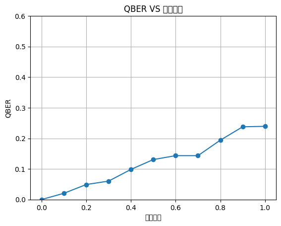
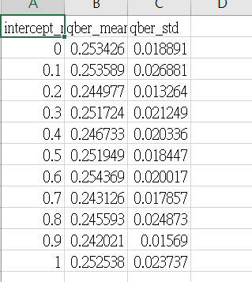

# 🧪 BB84 量子金鑰分發模擬專案

---

## 📘 專案簡介
本專案模擬了 BB84 量子金鑰分發（Quantum Key Distribution, QKD）協定，並逐步加入不同的 Eve 攻擊模型，用於展示 QKD 在實際應用中對抗中間人攻擊（Man-in-the-Middle）與竊聽者（Eavesdropper）的強健性。本專案旨在透過 Python 模擬 BB84 協定，探討其面對各類攻擊模型（如攔截重送與身份偽造）時的安全性變化，並透過 QBER 可視化分析以驗證協定的實用防禦能力。

---

## 📁 專案結構說明

├── bb84_basic.py # 基本 BB84 協定模擬（無 Eve）
├── eve_basic_attack.py # Eve 隨機攔截攻擊模型 + QBER 分析
├── eve_impostor_attack.py # Eve 假冒 Alice/Bob 攻擊模型（進階）
├── 自述文件.md # 初期撰寫的簡要說明備份
└── README.md # 本說明文件，完整介紹與成果整理

---

## 🧠 實作內容（摘要）

- 🔹 模擬 Alice 與 Bob 的量子位元生成與傳送流程  
- 🔹 加入 Eve 攻擊行為，觀察 QBER（Quantum Bit Error Rate）變化  
- 🔹 可視化密鑰錯誤率圖表，顯示攻擊前後安全性影響  
- 🔹 進階版攻擊實作：Eve 假冒 Alice 或 Bob，探討身份偽造的風險  

---

## 📈 模擬延伸：QBER 與攔截比例（2025/07/15 新增）

為進一步量化 Eve 攻擊對 BB84 安全性的影響，本模擬設計不同攔截比例（Intercept Ratio）下的 QBER 分析。攔截比例自 0.0 增至 1.0（每次增幅 0.1），結果顯示 QBER 隨攔截比例上升而顯著增加，驗證 BB84 協定可偵測竊聽行為。
本專案不僅重現經典 BB84 協定，亦首次整合 QBER 可視化與資料表，模擬不同攻擊策略下的錯誤變化趨勢，並建立後續擴充模型的實驗基礎。

📎 對應程式檔案：eve_basic_attack.py  
📊 可視化圖表：result_plot.png（請見 repo 圖片）

---

## 🚀 可延伸研究方向

- 🧪 加入部分攔截攻擊（Partial Intercept）、記憶型 Eve 等攻擊邏輯  
- 🔐 整合 Post-Quantum Cryptography（PQC）模擬與防禦策略  
- 🔄 探討 BB84 與 E91 協定設計邏輯與應用情境比較
- 📌 探討 QKD 協定在面對量子攻擊與竊聽滲透下的實際防禦潛力，進一步以 BB84 為核心，設計「可預警的通訊防禦模組」，作為量子資安應用雛型。
- 🛡️ 本專案也可作為模擬國防通訊環境中，竊聽偵測與攻擊防禦模型的教學用途，尤其在量子密碼學與未來 PQC 標準推動中有應用潛力。

---

## 💻 如何執行

請確認已安裝 Python 3 環境，可透過終端機依序執行以下指令：

bash
python bb84_basic.py
python eve_basic_attack.py
python eve_impostor_attack.py

# 🧪 QKD Simulation：BB84 協定模擬與 Eve 攻擊分析

本專案模擬量子密鑰分配協定 BB84，並進一步探討常見的攻擊模型如中間人攻擊（Intercept-Resend）、假冒身份攻擊（Impersonation）等場景，並觀察錯誤率（QBER）變化以驗證 BB84 的安全性。

---

## 📁 專案結構說明

| 檔案名稱 | 說明 |
|----------|------|
| `bb84_basic.py` | 基本 BB84 協定模擬（無 Eve） |
| `eve_basic_attack.py` | Eve 攔截 qubit 攻擊 + QBER 分析 |
| `eve_impostor_attack.py` | Eve 假冒 Alice 或 Bob 的進階攻擊模型 |
| `自述文件.md` | 初期構思與學習紀錄備份用 |
| `README.md` | 本說明檔，完整介紹程式與模擬架構 |
| `result_plot.png` | 攔截比例與 QBER 的可視化圖表 |

---

## 🔍 實作內容（摘要）

- 模擬 Alice 與 Bob 傳輸 qubit 並完成密鑰篩選流程  
- 加入 Eve 攻擊行為，觀察 QBER（Quantum Bit Error Rate）變化  
- 可視化錯誤率與攔截比例之關係，展示攻擊行為對安全性的影響  
- 進階模擬攻擊場景：Eve 假冒 Alice 或 Bob，探討身份偽造風險  

---

### 📊 QBER 與攔截比例模擬（2025/07/15 新增）

為進一步量化 BB84 對竊聽的抵抗能力，本模擬設計 Eve 以不同攔截比例進行攻擊（0.0～1.0），並計算 sifted key 中的 QBER 變化。

模擬邏輯：
- 當 Eve 攔截 qubit 並猜錯基底，將導致 Bob 測量結果發生錯誤
- 攔截比例越高，錯誤率越明顯，QBER 因此上升

> 實驗結果：當攔截比例達 100%，QBER 接近 24%，驗證 BB84 協定具備有效偵測攻擊之能力。

📈 結果圖示：

📁 對應檔案：`eve_basic_attack.py`

---

## 🚀 可延伸研究方向

📎 [點我查看產生圖表的 Python 程式碼](qber_vs_intercept_ratio.py)

- 實作部分攔截（Partial Intercept）與記憶型攻擊（Memory-based Eve）
- 模擬 Eve 假冒雙方身份並分析密鑰洩露機率
- 探討 PQC（Post-Quantum Cryptography）與 QKD 的結合應用
- 製作不同攻擊策略下的 QBER 比較圖表，視覺化攻擊風險
- 延伸模擬 PQC 演算法在傳輸階段可能遭受的量子攻擊策略，作為未來拓展方向。

### 🌍 國際標準趨勢補充：PQC 與 QKD 結合發展潛力

- 🇺🇸 **NIST**（美國國家標準與技術研究院）：已完成第一輪 PQC 演算法標準遴選，最終選定 Kyber、Dilithium 等演算法（2024）。
- 🇪🇺 **ETSI**（歐洲電信標準協會）：推動 QKD 與 PQC 整合通信標準，強調量子密鑰與後量子演算法互補。
- 🌐 **ISO/IEC 23837**（國際標準草案）：提出 QKD 與 PQC 密鑰交換機制之整合架構，研擬跨國部署標準。

### 📊 QBER 錯誤率 vs 攔截比例

本圖視覺化呈現攔截行為與密鑰錯誤率（QBER）之關聯，有助於量化風險與設計偵測策略。
攔截比例越高，QBER 趨勢上升，可作為偵測 Eve 竊聽行為的指標。

#### 📋 資料來源表格（mean 與 std）如下，顯示不同攔截比例下的平均錯誤率（QBER mean）與標準差（QBER std）：

此資料可進一步用於誤差條圖（error bar）繪製，提升圖表的準確性與學術可信度。

---

## 💻 如何執行

請確認已安裝 Python 3 環境，可透過終端機依序執行：
bash
python bb84_basic.py
python eve_basic_attack.py
python eve_impostor_attack.py
python qber_vs_intercept_ratio.py
pip install -r requirements.txt
---

## 📅 更新紀錄

- 2025/07/23：調整 QBER vs 攔截比例模擬程式與圖表路徑，統一移至 `bb84/images/` 資料夾
- 2025/07/15：新增 QBER vs 攔截比例模擬程式與圖表
- 2025/07/14：完成 Eve 假冒模型的初版程式架構
- 2025/07/13：整合基本 BB84 與 Eve 攻擊模擬之程式碼邏輯

---
