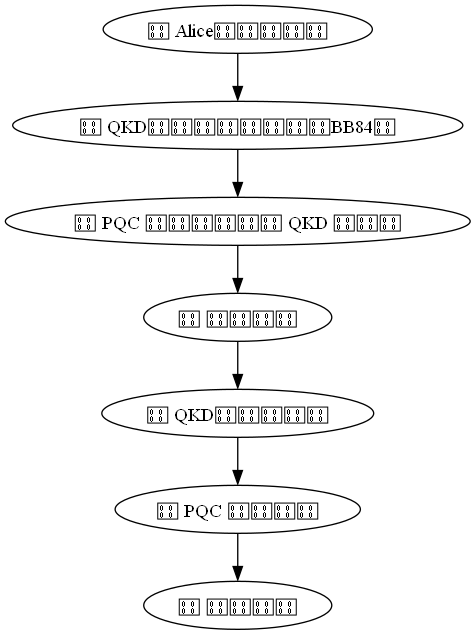

# 🔐 PQC × QKD 混合式密鑰交換模擬

本模擬展示後量子密碼學（PQC）與量子金鑰分發（QKD）結合的加密應用，整合 QKD 產生的共享金鑰與 PQC 加解密邏輯，模擬未來混合安全架構。

---

## 📌 模擬流程說明

1. 使用 BB84 協定模擬產生共享 bit 密鑰
2. 將密鑰加總並轉為整數作為 PQC 加密用位移量
3. 利用簡化 PQC 模組進行文字加密與解密
4. 結果顯示：明文、密文、位移量、還原結果

---

## 🧪 使用方式

```bash
pip install -r requirements.txt
python pqc_qkd_hybrid_simulation.py
python draw_hybrid_flowchart.py

🧠 備註：

QKD 產生 [0, 1] bit 串，模擬 BB84 協定

PQC 模擬為簡化位移加密（類似 Caesar cipher）

僅供教學用途，非正式密碼演算法

📁 專案結構

pqc_qkd_hybrid/
├── pqc_qkd_hybrid_simulation.py     # 主程式
├── pqc_module.py                    # PQC 演算法模組（簡化位移加密）
├── qkd_module.py                    # QKD 模組（模擬 BB84 協定）
├── draw_hybrid_flowchart.py         # 流程圖繪製程式
├── images/
│   └── hybrid_flowchart.png         # 混合架構流程圖（使用 matplotlib）
├── README.md                        # 主自述文件（本檔）
├── README_HYBRID_SIM.md             # 主程式說明（擴充用）
├── README_PQC_MODULE.md             # PQC 模組說明
├── README_QKD_MODULE.md             # QKD 模組說明
└── requirements.txt                 # 相依套件清單

🖼️ 流程圖展示
以下為 PQC × QKD 混合式加密流程示意圖：

[](images/hybrid_flowchart.png)

🔧 相依套件（requirements.txt）

matplotlib
networkx

🧩 未來延伸方向
將 PQC 模組替換為 Kyber 參數模擬

模擬 Eve 攻擊者插入干擾或假冒

加入錯誤率（QBER）與安全閾值偵測機制

對比密鑰長度對安全性的影響

結合 PQC 與 QKD 對抗量子電腦攻擊模型

📄 授權
MIT License


---
