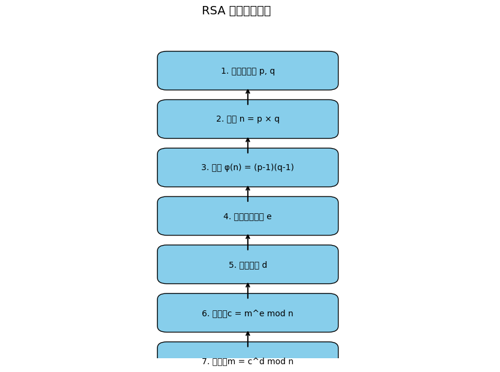

# 🔐 RSA 加密流程圖示模擬

本專案為 RSA 公鑰加密演算法的可視化流程圖。透過簡潔的圖像呈現從金鑰生成、加密到解密的整體邏輯，幫助初學者理解 RSA 的運作方式。

---

## 📌 演算法步驟

1. 產生兩個質數 `p` 與 `q`
2. 計算模數 `n = p × q`
3. 計算歐拉函數 `φ(n) = (p-1)(q-1)`
4. 選擇公開金鑰 `e`（需與 φ(n) 互質）
5. 計算私鑰 `d`，滿足 `e × d ≡ 1 mod φ(n)`
6. 加密：`c = m^e mod n`
7. 解密：`m = c^d mod n`

---

## 🖼️ 圖片範例



---

## 🚀 如何執行

```bash
pip install -r requirements.txt
python rsa_process_diagram.py
執行後會在 images/ 資料夾下產生流程圖 rsa_process.png.png。
